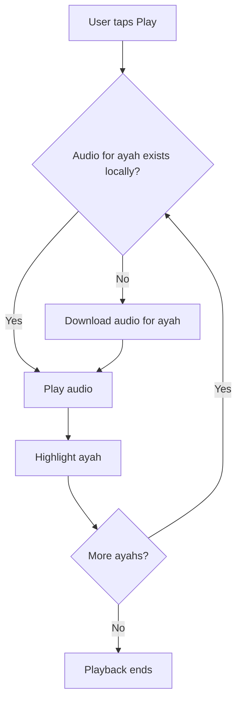
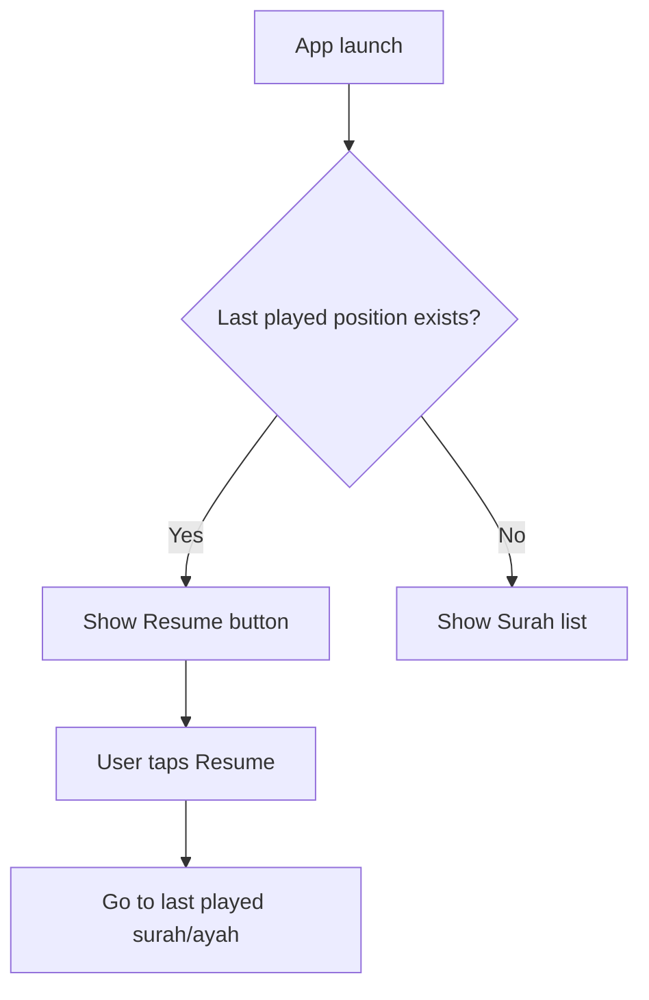

# Quran Audio Project

## Overview

Quran Audio is a mobile/web application designed to provide users with easy access to Quranic audio recitations, supporting multiple reciters, offline audio playback, and a rich, customizable reading experience. The app leverages local and remote resources for Quranic text and audio, and offers features for seamless listening, navigation, and personalization.

---

## Table of Contents

1. [Core Use Cases](#core-use-cases)
2. [Functional Requirements](#functional-requirements)
3. [Non-Functional Requirements](#non-functional-requirements)
4. [Screen-by-Screen UI/UX Flow](#screen-by-screen-uiux-flow)
5. [Data Flow & Diagrams](#data-flow--diagrams)
6. [File Formats & Data Sources](#file-formats--data-sources)
7. [Settings & Personalization](#settings--personalization)
8. [Persistence & Offline Support](#persistence--offline-support)
9. [Dark Mode & Accessibility](#dark-mode--accessibility)

---

## Core Use Cases

1. **Browse Surahs**
   - View a list of all 114 surahs with Arabic names, numbering, and verse counts.
2. **View Surah Details**
   - Tap a surah to see all its ayahs in Arabic.
3. **Play Surah Audio**
   - Play audio for the entire surah, verse by verse, with real-time highlighting.
   - Select a reciter from a dropdown.
   - Download audio on-demand and cache for offline use.
4. **Play from Specific Ayah**
   - Start audio playback from any selected ayah onward.
5. **Resume Playback**
   - Resume audio from where the user last left off, even after closing the app.
6. **Font Size Adjustment**
   - Increase or decrease font size for surah names and ayahs.
7. **Dark/Light Mode**
   - Toggle between dark and light themes.

---

## Functional Requirements

### Surah List

- Display all surahs with:
  - Arabic name
  - Surah number
  - Number of ayahs
- Button to resume last played ayah/surah

### Surah Detail

- Show all ayahs in Arabic
- Audio controls:
  - Play/Pause button
  - Reciter selection dropdown
  - Highlight currently playing ayah
  - Option to start playback from any ayah
- Download audio for ayahs as needed
- Show download/progress indicator if audio is being fetched

### Audio Management

- Check if audio file exists locally before downloading
- Download first ayah and start playback immediately
- Download remaining ayahs in background
- Play ayahs sequentially, highlighting each
- Allow user to seek to any ayah

### Persistence

- Save last played surah and ayah
- Save user settings (font size, theme)
- Store downloaded audio files for offline playback

### Settings

- Font size adjustment (for surah names and ayahs)
- Theme toggle (dark/light)

---

## Non-Functional Requirements

- Fast, responsive UI
- Offline support for previously downloaded audio
- Efficient storage management
- Accessibility (font size, color contrast)
- Cross-platform (if targeting both mobile and web)

---

## Screen-by-Screen UI/UX Flow

### 1. Home Screen (Surah List)

- **Components:**
  - App title/header
  - Resume playback button (if applicable)
  - List of surahs (Arabic name, number, ayah count)
  - Settings button (font size, theme)
- **Actions:**
  - Tap surah → Go to Surah Detail
  - Tap resume → Go to last played surah/ayah
  - Tap settings → Open settings modal/screen

### 2. Surah Detail Screen

- **Components:**
  - Surah name and number
  - Reciter dropdown
  - Play/Pause button
  - List of ayahs (Arabic)
  - Highlight for currently playing ayah
- **Actions:**
  - Tap play → Start audio from beginning or selected ayah
  - Tap ayah → Start playback from that ayah
  - Change reciter → Switch audio source

### 3. Settings Modal/Screen

- **Components:**
  - Font size slider/buttons
  - Theme toggle (dark/light)
- **Actions:**
  - Adjust font size → Update all text sizes
  - Toggle theme → Switch app appearance

---

## Data Flow & Diagrams

### Audio Playback & Download Flow

### Resume Playback Flow

---

## File Formats & Data Sources

- **quran_text.xml**: Contains all surah and ayah texts in Arabic.
- **recitation.json**: Contains reciter info and audio folder mapping.
- **Audio files**: Downloaded from URLs like `https://everyayah.com/data/{reciter_folder}/{SSSAAA}.mp3`
  - `SSS` = 3-digit surah number (e.g., 001)
  - `AAA` = 3-digit ayah number (e.g., 001)

> You may convert these files to a more efficient format (e.g., JSON) for faster access if needed.

---

## Settings & Personalization

- Font size (small, medium, large, or slider)
- Theme (light/dark)
- Persist user preferences locally

---

## Persistence & Offline Support

- Store downloaded audio files in local storage
- Save last played surah/ayah in persistent storage
- Save user settings (font size, theme)

---

## Dark Mode & Accessibility

- Provide high-contrast color schemes for dark/light mode
- Ensure all text is resizable
- Use accessible fonts and controls

---

## Summary of Screens

| Screen       | Components                                                     | Actions/Features                                |
| ------------ | -------------------------------------------------------------- | ----------------------------------------------- |
| Home         | Surah list, Resume button, Settings                            | Browse, Resume, Go to Settings                  |
| Surah Detail | Surah name, Reciter dropdown, Play/Pause, Ayah list, Highlight | Play, Select reciter, Seek, Highlight, Download |
| Settings     | Font size control, Theme toggle                                | Adjust font, Switch theme                       |

---

> This document serves as a comprehensive guide for both product and development teams to build the Quran Audio application efficiently and with clarity.
